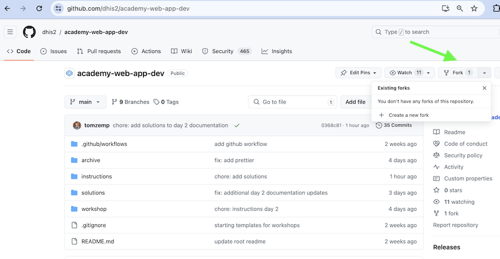
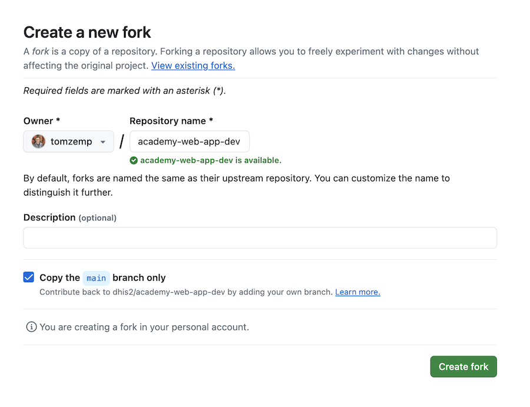
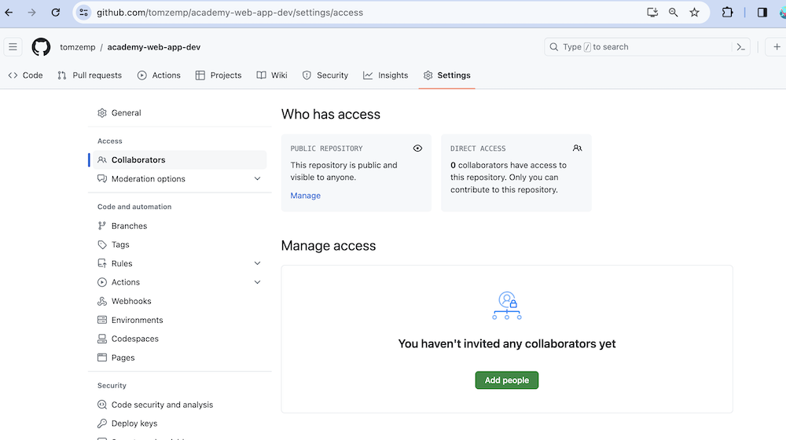
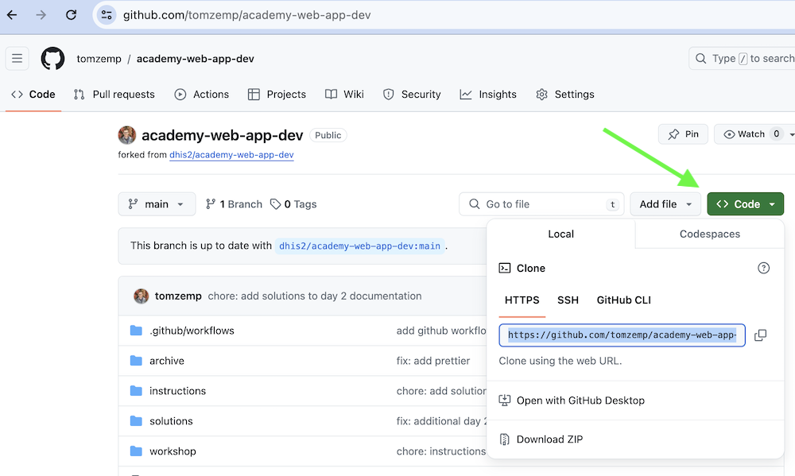

# Get Started

We will be working on individual forks of the same repository.

Each day, we will checkout a new branch and then open a PR to merge the work back into the `main` branch.

## Fork the repository

We will be working with this repository: https://github.com/dhis2/academy-web-app-dev.

The first step is to fork the repository. If you do this through the GitHub UI, you can click the "Fork" button on the repository's start page. This will look like the below:



You should be able to proceed with the default settings when creating your fork (you do not need to include the branches other than `main`). Click "Create fork".



Please add the course instructors as collaborators as this will help us add comments on your work. To do this, from your newly forked repository, click on the "Settings" tab (in the top header bar), then on "Collaborators" (in the side bar)

Our GitHub names are `kabaros` (Mozafar), `tomzemp` (Tom), `Topener` (Rene).



##  Set up your repo locally

From your forked repository page on GitHub, click the green button **Clone** in the “Clone with HTTPs” section, then copy the URL for your repository.



Next, on your local machine, open your terminal and change your current working directory to the location where you would like to clone your repository (for example: `cd Documents`)

Once you have navigated to the directory where you want to put your repository, run the following (make sure to change to use the actual url copied from the step above):

```sh
git clone https://github.com/YOUR-GITHUB-NAME/academy-web-app-dev.git
```

The `git clone` command copies your repository from GitHub to your local computer.

## Working on assignments

On your terminal, navigate to the directory where your forked repository is saved.

:::info[Workshop directory]
We will be working in the subdirectory "workshop" throughout this course.
:::

This directory contains some basic boilerplate code for you to get started with. Follow these steps to setup your working directory:

* First, navigate to the directory:

```sh
cd workshop
```

* Run `yarn install` to fetch all packages and dependencies.

```sh
yarn install
```

You are now ready to start your application locally!

### Start your DHIS2 application locally

Run `yarn start` - This will run the app in the development mode.

```sh
 yarn start
```

From the browser, go to [http://localhost:3000](http://localhost:3000). You will see the following page:


Before you sign in, you need to log in to the DHIS2 instance which will be your **server**:
  - Go to: https://dev.im.dhis2.org/academy-web
  - You will see this page:

  - Sign in as username: `admin` and password: `district`

* Finally, go back to [http://localhost:3000](http://localhost:3000) and enter the following:

```
server: https://dev.im.dhis2.org/academy-web
username: admin
password: district
```

The code should look like this when you run it for the first time:


## Workflow

While in a real-life project, we would encourage that you open a pull request (PR) for each task, get the PR reviewed, and the finally merge it into your main branch, we will be performing a simplified 

1. Optional: Create a new branch in your repository
1. Work on this branch and commit changes as
1. Create a Pull Request (PR) against the original repository's main branch (you can create this)
1. Instructors will provide feedback on your submissions, either throughout the course, or after the completion of the course.

### Creating a new branch in your repository

You can [create a branch](https://docs.github.com/en/github/collaborating-with-issues-and-pull-requests/creating-and-deleting-branches-within-your-repository#creating-a-branch) on your GitHub repository. You can give your branch a name that matches the day, for example: `day2`
* Or from your terminal:

```
git checkout -b working
# A new branch working will be created
```

Make sure you're on the right branch when doing work!

### Work on this branch and commit changes as you work on tasks:

Commit your code as you work on each task
```
yarn format
git add .
git commit -m "<type-commit-message>"
git push
```

:::note[Push for first time]
The first time you push your new branch you will need to run `git push --set-upstream origin BRANCH_NAME`
:::

:::note[Format your code]
Make sure to run `yarn lint` and resolve any errors before commiting. Then run `yarn format` to make sure there are no style validations. This will keep the code readable.
:::

### Create a Pull Request (PR) against the original repo

Once you push the changes to your repository, the **Compare & pull request** green button will appear on GitHub. Click and follow the instructions. Add a name for your PR (e.g. `Tom 2024 Academy`) and leave a comment. 

Open a pull request by clicking the `Create pull request` green button.


### Receive review from instructors

You can request a review from the instructors by clicking on reviewers and adding us as reviewers. We will, however, provide most of our feedback during the day in person 😊.
